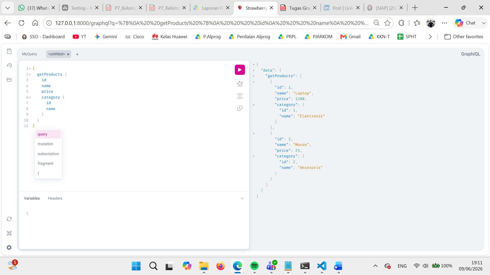
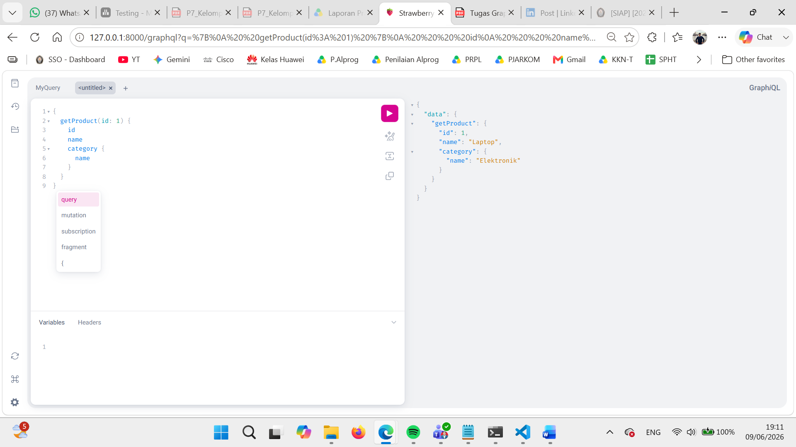
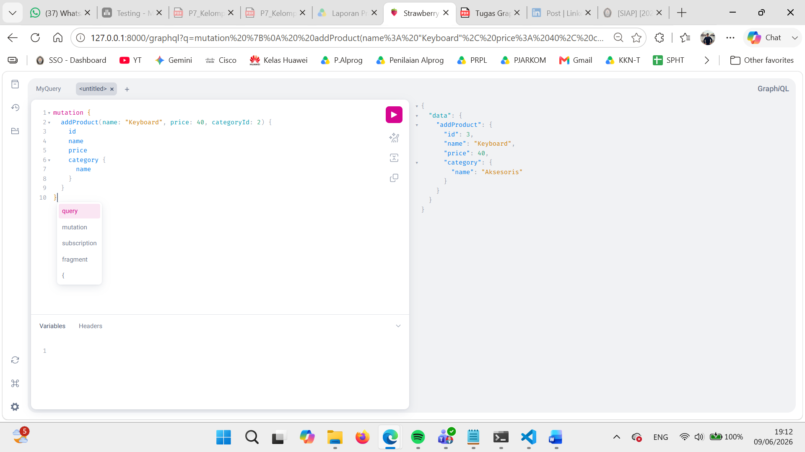
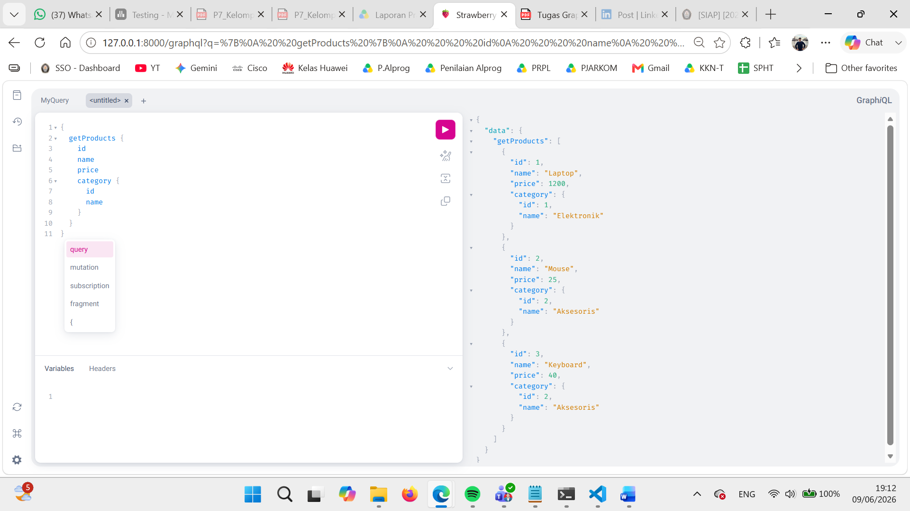

# 🛒 Toko Online — GraphQL API

> Tugas Mata Kuliah **Metoda Pemrograman Modern** · Implementasi GraphQL API menggunakan FastAPI & Strawberry (Python)


---

## 📌 Deskripsi

Proyek ini adalah implementasi **GraphQL API** sederhana untuk domain **Toko Online** yang dibangun menggunakan **FastAPI** dan **Strawberry**. Data disimpan secara *in-memory* (tanpa database eksternal). API mendukung operasi **Query** dan **Mutation** untuk mengelola produk dan kategori, serta dapat diuji langsung melalui **GraphQL Playground**.

---

## ✨ Fitur

| Fitur | Tipe | Deskripsi |
|---|---|---|
| `getProducts` | Query | Ambil semua produk beserta kategori |
| `getProduct(id)` | Query | Ambil detail satu produk by ID |
| `getCategories` | Query | Ambil semua kategori *(Bonus A)* |
| `addProduct` | Mutation | Tambah produk baru |
| `addCategory` | Mutation | Tambah kategori baru *(Bonus A)* |

---

## 🛠️ Tech Stack

- **Python** 3.11+
- **FastAPI** — web framework
- **Strawberry** — GraphQL library untuk Python
- **Uvicorn** — ASGI server
- **GraphiQL** — GraphQL Playground (built-in)

---

## 🚀 Cara Menjalankan

### 1. Clone Repository
```bash
git clone https://github.com/username/mpm-graphql.git
cd mpm-graphql
```

### 2. Buat & Aktifkan Virtual Environment
```bash
# Buat virtual environment
python -m venv env

# Aktifkan (Windows)
env\Scripts\activate

# Aktifkan (Mac/Linux)
source env/bin/activate
```

### 3. Install Dependencies
```bash
pip install fastapi uvicorn strawberry-graphql
```

### 4. Jalankan Server
```bash
uvicorn main:app --reload
```

### 5. Buka GraphQL Playground
Akses di browser: **http://127.0.0.1:8000/graphql**

---

## 📖 Contoh Query & Mutation

### 🔍 Query Semua Produk
```graphql
{
  getProducts {
    id
    name
    price
    category {
      id
      name
    }
  }
}
```

### 🔍 Query Detail Produk by ID
```graphql
{
  getProduct(id: 1) {
    id
    name
    category {
      name
    }
  }
}
```

### ➕ Mutation Tambah Produk
```graphql
mutation {
  addProduct(name: "Keyboard", price: 40, categoryId: 2) {
    id
    name
    price
    category {
      name
    }
  }
}
```

### ➕ Mutation Tambah Kategori *(Bonus)*
```graphql
mutation {
  addCategory(name: "Periferal") {
    id
    name
  }
}
```

---

## 📸 Dokumentasi Screenshot

### 1️⃣ Query Semua Produk + Nested Category
> Menampilkan semua produk (Laptop & Mouse) beserta informasi kategorinya dalam satu request.



---

### 2️⃣ Query Detail Produk by ID
> Mencari produk dengan ID tertentu, menampilkan detail produk beserta kategorinya.



---

### 3️⃣ Mutation Tambah Produk
> Menambahkan produk baru "Keyboard" ke dalam data, dan server merespons dengan data produk yang baru dibuat.



---

### 4️⃣ Verifikasi Data Setelah Mutation
> Menjalankan ulang query semua produk untuk membuktikan bahwa produk "Keyboard" berhasil tersimpan.



---

## 📊 Analisis REST vs GraphQL

### ✅ Kapan GraphQL Lebih Cocok?

1. **Data yang dibutuhkan antar klien berbeda-beda** — misalnya aplikasi mobile hanya butuh `name` dan `price`, sementara web butuh semua field termasuk kategori. Dengan GraphQL, setiap klien bisa meminta hanya field yang dibutuhkan (*no over-fetching*).

2. **Relasi data yang kompleks** — seperti produk → kategori → supplier. GraphQL memungkinkan pengambilan semua relasi tersebut dalam **satu request** tanpa perlu melakukan beberapa endpoint call seperti di REST.

### ✅ Kapan REST Lebih Cocok?

1. **API publik yang sederhana dan mudah didokumentasikan** — endpoint REST seperti `GET /products` lebih intuitif dan familiar bagi banyak developer, sehingga lebih mudah dikonsumsi tanpa perlu memahami skema GraphQL.

2. **Operasi berbasis file atau streaming** — seperti upload/download file, REST lebih tepat karena GraphQL tidak dirancang untuk menangani tipe data biner secara efisien.

### ⚠️ Risiko & Mitigasi GraphQL

| Risiko | Mitigasi |
|---|---|
| **N+1 Query Problem & Nested Depth berlebihan** — query yang terlalu dalam secara rekursif dapat membebani server | Terapkan **query depth limiting** menggunakan middleware, batasi kedalaman maksimum query (misalnya max depth = 5) |

---

## 📁 Struktur Proyek

```
mpm-graphql/
├── env/                  ← virtual environment (tidak di-commit)
├── screenshots/          ← folder screenshot playground
│   ├── screenshot_1_query_list.png
│   ├── screenshot_2_query_detail.png
│   ├── screenshot_3_mutation.png
│   └── screenshot_4_verifikasi.png
├── main.py               ← kode utama GraphQL API
├── README.md             ← dokumentasi proyek
└── .gitignore
```

---

## 👤 Author

**Ivan Admaja Kuncoro** · Mahasiswa Teknik Informatika  
📧 ivankuncoro06@gmail.com · [GitHub](https://github.com/panipanpan2006)

---

> *Dibuat untuk memenuhi tugas Mata Kuliah Metoda Pemrograman Modern*